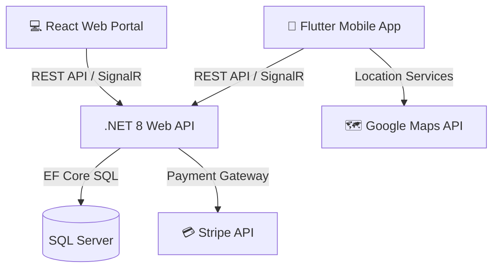

<div align="center">

# 🚦 🚑 Smart Traffic & Emergency Management System (STMS)

**An End-to-End Smart City Platform for Real-Time Traffic Monitoring, Road Incident Management, and Automated Emergency Roadside Assistance.**


</div>

---

## 📌 Overview

**STMS** is a full-stack graduation project engineered to solve urban traffic congestion, enable rapid roadside assistance (towing, battery jumps, fuel delivery, flat tires), and provide unified operational dashboards for city administrators, emergency response teams, customer support agents, and automotive sellers.

---

## 🏗️ System Architecture



---

## ✨ Key Features Matrix

| Module | Sub-System | Key Capabilities |
| :--- | :--- | :--- |
| **📱 Mobile App** | `STMS-main` | • Live Support Chat with Customer Service<br>• Emergency SOS trigger & Real-time provider tracking<br>• Interactive Traffic Map & Incident Reporting<br>• In-App Store & Stripe Payment Checkout |
| **👑 Admin Portal** | `my-project` | • System-wide user approvals & role management<br>• System health, support ticket workspace, & analytics<br>• Incident history audit & live clock monitoring |
| **🎧 CS Agent Panel** | `my-project` | • Real-time SignalR ticket chat workspace<br>• Driver & provider lookup with block/unblock tools<br>• Incident escalation & support reporting |
| **🚜 Rescue Provider** | `my-project` | • Active mission dispatch & real-time route updates<br>• Mission arrival & completion tracking<br>• Earnings dashboard with weekly analytics |
| **🛒 Store Seller** | `my-project` | • Product catalog management & inventory control<br>• Real-time order processing & status updates |
| **⚙️ Backend API** | `src` | • Indexed EF Core SQL Server persistence<br>• Dynamic JWT Refresh Token authentication<br>• Secure Stripe Webhook HMAC signature validation |

---

## 📁 Repository Structure

```
SmartTrafficManagement/
├── src/                                  # .NET 8 Backend API & Infrastructure
│   ├── SmartTrafficManagement.API/       # Web API Controllers, Hubs, & Configurations
│   ├── SmartTrafficManagement.Application/# CQRS, DTOs, & Business Logic Handlers
│   ├── SmartTrafficManagement.Core/      # Entities, Constants, & Interfaces
│   └── SmartTrafficManagement.Infrastructure/# EF Core, SignalR, & Database Migrations
├── my-project/                           # React Web Operations Portal (Admin, CS, Provider, Seller)
│   ├── src/
│   │   ├── api/                          # API Client & SignalR Services
│   │   ├── components/                   # UI Components & Navigation
│   │   └── pages/                        # Role-based Dashboards (Admin, CsAgent, Provider, Seller)
│   └── vite.config.js
└── STMS-main/                            # Flutter Mobile Client Application
    ├── lib/
    │   ├── core/                         # Network ApiClient, SignalR, & Theme System
    │   └── features/                     # Auth, Emergency Tracking, Traffic Maps, & Live Chat
    └── pubspec.yaml
```

---

## 🚀 Getting Started

### 📋 Prerequisites

Ensure you have the following installed on your machine:
- [.NET 8.0 SDK](https://dotnet.microsoft.com/download/dotnet/8.0)
- [Node.js 18.0+](https://nodejs.org/)
- [Flutter SDK 3.19+](https://docs.flutter.dev/get-started/install)
- [SQL Server](https://www.microsoft.com/sql-server/) (or SQL LocalDB / Docker container)

---

### 1️⃣ Run Backend API (.NET 8)

```bash
cd src/SmartTrafficManagement.API

# Restore dependencies
dotnet restore

# Apply database migrations
dotnet ef database update --project ../SmartTrafficManagement.Infrastructure --startup-project .

# Run the API server
dotnet run
```
> **Default Endpoints**: `http://localhost:5066` | Swagger UI at `http://localhost:5066/swagger`

---

### 2️⃣ Run Web Portal (React + Vite)

```bash
cd my-project

# Install dependencies
npm install

# Start Vite dev server
npm run dev
```
> **Access Portal**: `http://localhost:5173`

---

### 3️⃣ Run Mobile App (Flutter)

```bash
cd STMS-main

# Get packages
flutter pub get

# Run on target device / emulator
flutter run
```

---

## 🔐 Security & Reliability Highlights

- **Dynamic Token Refresh**: Both React and Flutter clients feature seamless 401 interceptors to auto-refresh JWT tokens without disturbing user sessions.
- **Production Webhook Security**: Stripe Webhook HMAC signature validation enforced in production to prevent forged payment events.
- **Database Optimization**: Custom SQL indexes on foreign keys (`Vehicles`, `TrafficReports`, `Orders`, `OrderItems`) ensuring sub-millisecond query execution.

---

## 👤 Author & Maintainer

Developed with ❤️ as a Graduation Project by **[Mohamed Ashraf](https://github.com/mohamed68909)**.